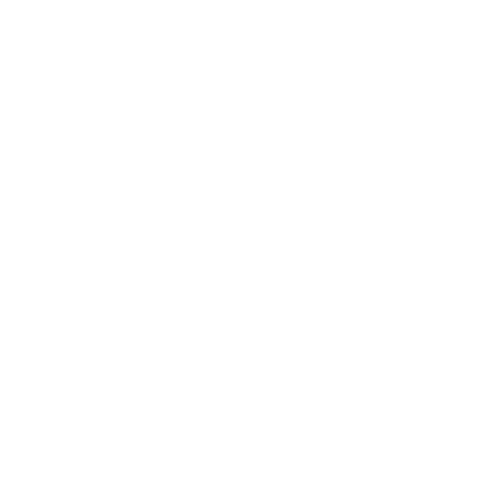
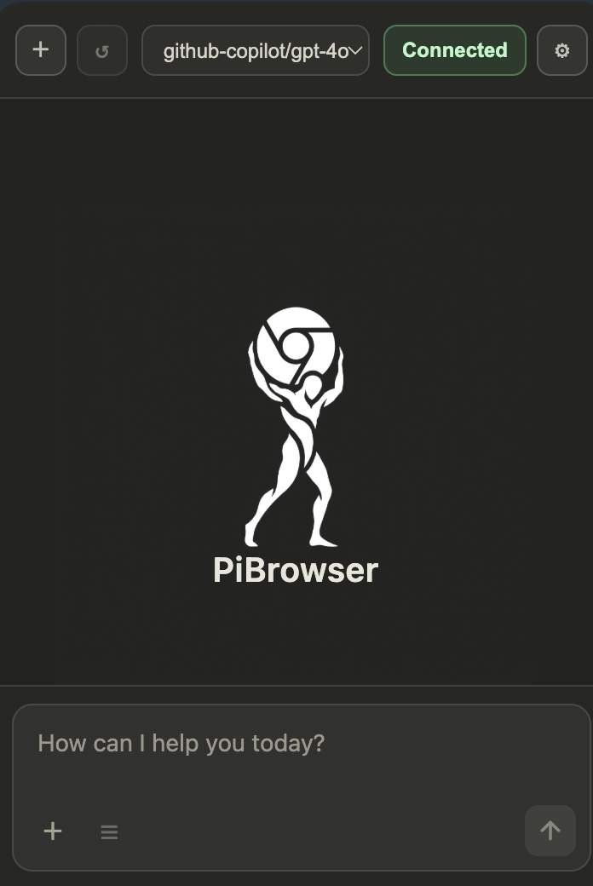

# PiChat ⚡️

<p align="center">
  <picture>
    <source media="(prefers-color-scheme: dark)" srcset="docs/images/pichat-logo-light.png" />
    <source media="(prefers-color-scheme: light)" srcset="docs/images/pichat-logo.png" />
    
  </picture>
</p>

<p align="center">
  <strong>Native macOS client for the <a href="https://github.com/badlogic/pi-mono">pi coding agent</a></strong>
</p>

<p align="center">
  
  
  
</p>

PiChat is a clean, production-ready SwiftUI desktop app that runs `pi --mode rpc` behind the scenes and gives you a modern GUI for everyday agentic coding.

---

## ⬇️ Download

### macOS

👉 **[Download PiChat for macOS (DMG)](https://github.com/Rrollan/PiChat/releases/latest/download/PiChat-macOS.dmg)**

### Windows

👉 **[Download PiChat for Windows (Installer EXE)](https://github.com/Rrollan/PiChat/releases/download/windows-v1.0.2/PiChat-Windows-Setup-1.0.2-x64.exe)**

Full Windows guide: **[docs/WINDOWS.md](docs/WINDOWS.md)**

---

## 🧩 Install (macOS)

1. Download `PiChat-macOS.dmg`
2. Open the DMG file
3. Drag **PiChat.app** to **Applications**
4. Open **Applications → PiChat**
5. If macOS shows a security warning: right-click the app → **Open**

The macOS app bundles the pi coding agent and Node.js runtime. A global `pi` install is not required for normal use.

---

## 🧩 Install (Windows)

1. Download and run **`PiChat-Windows-Setup-1.0.2-x64.exe`**.
2. Open **PiChat** from Start Menu or Desktop shortcut.
3. The Windows app includes a bundled pi runtime. If you intentionally want to use an external/global `pi`, open **Settings → Pi Runtime** and set its executable path.
4. Click **Reconnect** and start chatting.

See the full step-by-step guide: **[docs/WINDOWS.md](docs/WINDOWS.md)**.

---

## 🚀 First launch

1. Open PiChat.
2. Keep **Settings → Pi Runtime → Pi executable** set to `pi` to use the bundled/default runtime.
3. Optional: set a full path if you want PiChat to use an external `pi` executable instead.
4. Start chatting.

---

## ✨ Features

- Native SwiftUI UX for macOS
- Bundled pi runtime with manual and daily auto-updates
- Real-time chat with tool streaming
- Model and thinking controls
- Session stats (tokens / context / cost)
- Queue visibility (steering + follow-up)
- Drag & drop file and image attachments
- Extension dialogs (`confirm`, `select`, `input`, `editor`)
- Full config editing (`settings.json`, `models.json`, `auth.json`)
- Dynamic MCP list loaded from local `mcp.json`

---

## 🖼 Screenshots

<p align="center">
  
</p>

<p align="center">
  
</p>

---

## 🔐 Privacy & Release Readiness

This repository is prepared for public distribution:

- No hardcoded account keys
- No hardcoded personal model IDs
- No hardcoded MCP servers
- No hardcoded personal absolute paths
- RPC debug logs disabled by default

Run sanity scan before each release:

```bash
./scripts/sanity-check.sh
```

---

## 📦 Requirements

### macOS

1. macOS 14+
2. Xcode Command Line Tools are needed only when building from source
3. The distributed app includes pi and Node.js; no global `npm install -g` is required

### Windows

1. Windows 10/11 x64
2. The installer includes pi and Node.js
3. Node.js 20+ is only needed if you choose to use an external/global `pi` runtime

---

## 🚀 Build and Run

### macOS

```bash
swift build -c release
./scripts/build-app.sh      # packages the bundled pi runtime by default
open build/PiChat.app
```

For a local developer build without embedding pi, use `SKIP_PI_RUNTIME=1 ./scripts/build-app.sh`.

### Windows

```powershell
cd "windows version"
npm install
npm run verify:windows
npm run dist
```

The Windows installer is written to `windows version/release/PiChat-Windows-Setup-<version>-x64.exe`.

---

## 💿 Build DMG

```bash
./scripts/build-dmg.sh
```

Artifacts:

- `build/PiChat.app`
- `build/PiChat-macOS.dmg`

---

## 🧭 Release Flow (GitHub)

```bash
# 1) sanity + build
./scripts/sanity-check.sh
./scripts/build-dmg.sh

# 2) commit + tag
git add .
git commit -m "chore(release): prepare public launch"
git tag v1.0.0

# 3) push
git push origin main --tags

# 4) create release (optional via GH CLI)
gh release create v1.0.0 build/PiChat-macOS.dmg --title "PiChat v1.0.0" --notes-file docs/RELEASE_NOTES_v1.0.0.md
```

---

## 📁 Project Layout

- `PiChat/` — macOS app source
- `windows version/` — Windows Electron app source
- `scripts/` — macOS build + release scripts
- `docs/WINDOWS.md` — Windows installation guide
- `docs/images/` — logos and screenshots
- `.github/workflows/` — CI workflows for macOS and Windows builds

---

## 🌐 PiBrowser — browser control for PiChat

With **[PiBrowser](https://github.com/Rrollan/PiBrowser)**, PiChat can also control Chrome through real browser tools: inspect pages, open tabs, click, type, scroll, take screenshots, and answer questions about the current browser page.

<p align="center">
  <a href="https://github.com/Rrollan/PiBrowser">
    
  </a>
</p>

<p align="center">
  <strong>PiBrowser is the companion Chrome extension that gives the Pi agent real browser tools.</strong>
</p>

<p align="center">
  <a href="https://github.com/Rrollan/PiBrowser"><strong>Repository</strong></a>
  ·
  <a href="https://github.com/Rrollan/PiBrowser/releases/latest"><strong>Download extension ZIP</strong></a>
  ·
  <a href="https://github.com/Rrollan/PiBrowser/releases/latest/download/PiBrowser-extension.zip"><strong>Direct ZIP</strong></a>
</p>

<table>
  <tr>
    <td width="50%" valign="top">
      <h3>What it adds</h3>
      <ul>
        <li>Open tabs and navigate websites</li>
        <li>Read the current page and DOM context</li>
        <li>Click, type, press keys, and scroll</li>
        <li>Capture screenshots when visual context is needed</li>
        <li>Show a page highlight and animated cursor while the agent acts</li>
      </ul>
    </td>
    <td width="50%" valign="top">
      <h3>How to connect</h3>
      <ol>
        <li>Install PiChat.</li>
        <li>Install PiBrowser from the release ZIP.</li>
        <li>Open PiBrowser and copy its browser ID.</li>
        <li>Paste it into <strong>PiChat → Settings → Browser</strong>.</li>
        <li>Press <strong>Connect Browser</strong>, reload PiBrowser, then press <strong>Connect</strong>.</li>
      </ol>
    </td>
  </tr>
</table>

<p align="center">
  
</p>

PiBrowser runs as an executor: the reasoning stays in PiChat/pi, while Chrome actions go through explicit `browser_*` tools and return structured results back to the agent.

---

## 📄 License

MIT
