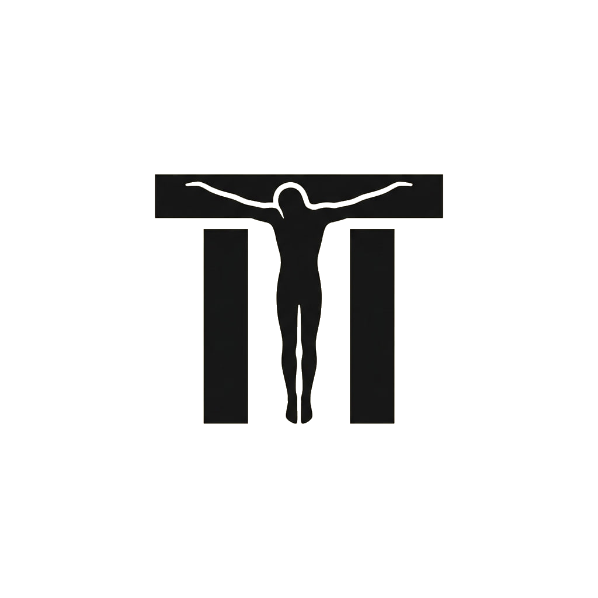
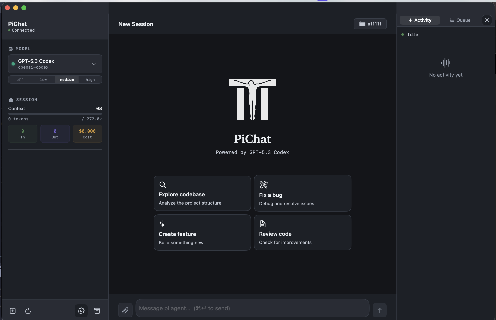
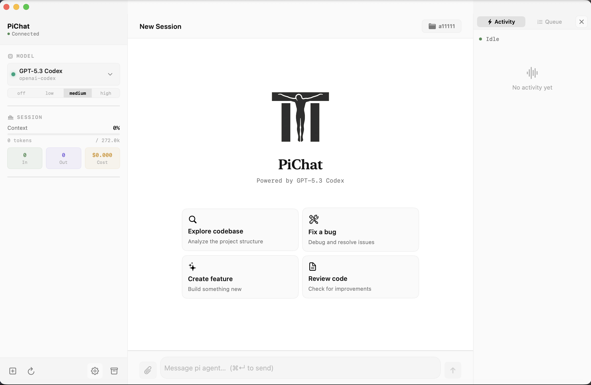

# PiChat ⚡️

<p align="center">
  
</p>

<p align="center">
  <strong>Native macOS client for the <a href="https://github.com/mariozechner/pi-coding-agent">pi coding agent</a></strong>
</p>

<p align="center">
  
  
  
</p>

PiChat is a clean, production-ready SwiftUI desktop app that runs `pi --mode rpc` behind the scenes and gives you a modern GUI for everyday agentic coding.

---

## ✨ Features

- Native SwiftUI UX for macOS
- Real-time chat with tool streaming
- Model and thinking controls
- Session stats (tokens / context / cost)
- Queue visibility (steering + follow-up)
- Drag & drop file and image attachments
- Extension dialogs (`confirm`, `select`, `input`, `editor`)
- Full config editing (`settings.json`, `models.json`, `auth.json`)
- Dynamic MCP list loaded from local `mcp.json`

---

## 🖼 Screenshots

<p align="center">
  
</p>

<p align="center">
  
</p>

---

## 🔐 Privacy & Release Readiness

This repository is prepared for public distribution:

- No hardcoded account keys
- No hardcoded personal model IDs
- No hardcoded MCP servers
- No hardcoded personal absolute paths
- RPC debug logs disabled by default

Run sanity scan before each release:

```bash
./scripts/sanity-check.sh
```

---

## 📦 Requirements

1. macOS 14+
2. Xcode Command Line Tools
3. Installed pi coding agent:

```bash
npm install -g @mariozechner/pi-coding-agent
```

---

## 🚀 Build and Run

```bash
swift build -c release
./scripts/build-app.sh
open build/PiChat.app
```

---

## 💿 Build DMG

```bash
./scripts/build-dmg.sh
```

Artifacts:

- `build/PiChat.app`
- `build/PiChat-macOS.dmg`

---

## 🧭 Release Flow (GitHub)

```bash
# 1) sanity + build
./scripts/sanity-check.sh
./scripts/build-dmg.sh

# 2) commit + tag
git add .
git commit -m "chore(release): prepare public launch"
git tag v1.0.0

# 3) push
git push origin main --tags

# 4) create release (optional via GH CLI)
gh release create v1.0.0 build/PiChat-macOS.dmg --title "PiChat v1.0.0" --notes-file docs/RELEASE_NOTES_v1.0.0.md
```

---

## 📁 Project Layout

- `PiChat/` — app source
- `scripts/` — build + release scripts
- `docs/images/` — logos and screenshots
- `.github/workflows/` — CI workflow for macOS build

---

## 📄 License

MIT
